# 👋 Hi there

*‘ ‘  あ さ ひ よ 、 の ぼ る な  ’ ’*

*—— 佐 倉 綾 音 / 花 譜 《 あ さ ひ 》*

## I'm Lukoning, also Aohina(あおひな).

> Note: this README was generated by Human General Intelligence (HGI).

Visitor count since 2025-03-09:

### 📊 Stats

### 🤔 About

<table>
    <tr>
        <td colspan="3"><em><del>😺 I'm a catboy student meow~</del></em></td>
    </tr>
    <tr align="center">
        <td>🇨🇳 Chinese</td>
        <td colspan="2">🏙️ Nánníng, G.Z.A.R.</td>
    </tr>
    <tr align="center">
        <td>🎂 2008-11</td>
        <td>🟢 MBTI: INFP</td>
        <td>🏳️‍🌈 Bisexuality</td>
    </tr>
    <tr>
        <td colspan="3">🗣️ Chinese too, a little English</td>
    </tr>
    <tr>
        <td colspan="3">♂️? A boy, or a girl, as you like :)</td>
    </tr>
</table>

 💕 Interests

 
 ✨ Art-Style: #二次元ACG(NM) - Anime, "Comics"(actually Manga), anime/manga-style Games, (light Novel, ACG-style Music)
     ✳️ Theme: #百合(Yuri, GL, Girl's Love) #蔷薇(BL, Boy's Love) #日常番(Slice-of-Life Anime) #有深度的世界观(Profound World)
     🎞️ Anime: #向山进发(ヤマノススメ, Encouragement of Climb) #超时空辉夜姬!(超かぐや姫！, Cosmic Princess Kaguya!) #孤独摇滚(ぼっち・ざ・ろっく！) #别当欧尼酱了!(おにまい, Onimai) #前辈是男娘(先輩はおとこのこ) #夜晚的水母不会游泳(夜のクラゲは泳げない) #小刻的画图写话(Kay's Daily Doodles) #天使降临到我身边(わたてん, WATATEN!) #时光流逝，饭菜依旧美味/PA饭(日々は過ぎれど飯うまし)
     🎮 Games: #原神(Genshin Impact) #OPUS: 龙脉常歌(OPUS: Echo of Starsong) #LittleBusters!  #KudWafter #言叶关系(The Expression Amrilato)  #蔚蓝档案(Blue Archive) #恋与深空(Love and Deepspace) #都市: 天际线(City: Skylines) #喵斯快跑(Muse Dash) #开放空间(Over Field)
     🎵 Music: #あさひ(朝日/Sunrise, artist: カンザキイオリ&花譜&佐倉綾音) #原神原声带(OSTs from Genshin Impact) ……
     👀 Other: Many, More, Endless
 

### 💬 Social Links

 
 

 📬 Email: [lukoning08@qq.com](mailto:lukoning08@qq.com)
 
### ❔ Non-social Link

Welcome to [my personal website](https://lukoning.github.io)! ( ⚠ WARNING! Full-Chinese. Bring your inaccurate translator, sit back and enjoy the joke. )

<!--
**Lukoning/Lukoning** is a ✨ _special_ ✨ repository because its `README.md` (this file) appears on your GitHub profile.

Here are some ideas to get you started:

- 🔭 I’m currently working on ...
- 🌱 I’m currently learning ...
- 👯 I’m looking to collaborate on ...
- 🤔 I’m looking for help with ...
- 💬 Ask me about ...
- 📫 How to reach me: ...
- 😄 Pronouns: ...
- ⚡ Fun fact: ...
-->
